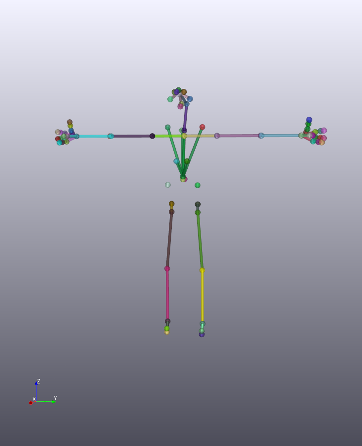
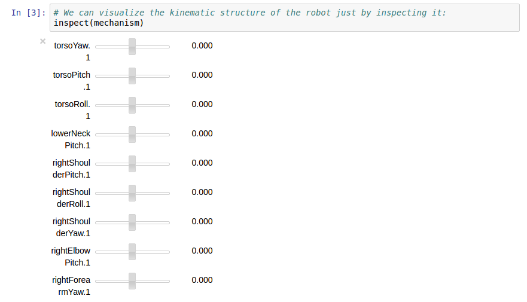
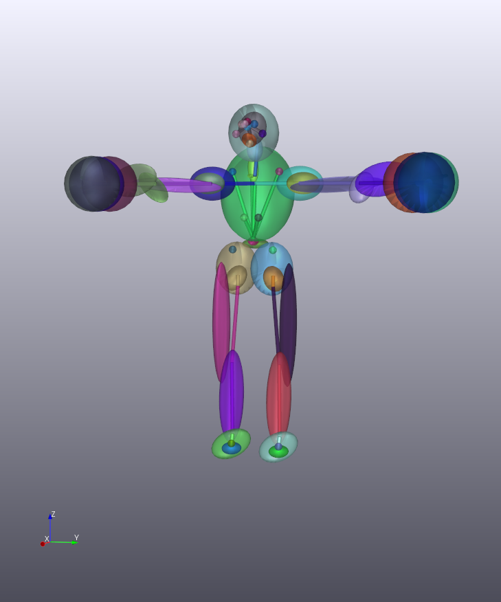
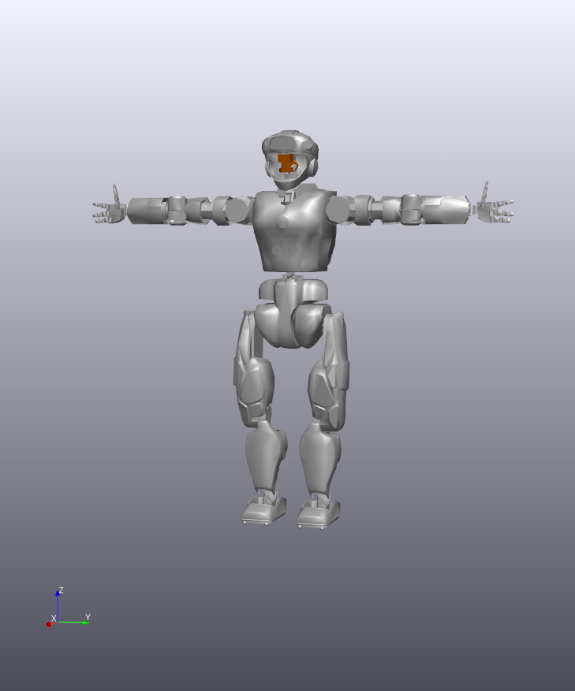

# RigidBodyTreeInspector

This package provides a simple tool for inspecting and manipulating the kinematic structure of a robot. It relies on several other packages to provide this functionality:

* [tkoolen/RigidBodyDynamics.jl](https://github.com/tkoolen/RigidBodyDynamics.jl) to parse and represent kinematic structures
* [RobotLocomotion/director](https://github.com/RobotLocomotion/director) for 3D visualization
* [rdeits/DrakeVisualizer.jl](https://github.com/rdeits/DrakeVisualizer.jl) to communicate with `director`
* [rdeits/PyLCM.jl](https://github.com/rdeits/PyLCM.jl) for message-passing and communication

# Installation

Not all of the packages required by RigidBodyTreeInspector are available as official Julia packages. You can see a list of the exact packages and versions in [REQUIRE.dev](https://github.com/rdeits/RigidBodyTreeInspector.jl/blob/master/REQUIRE.dev), and you can install those packages manually if you wish. However, the easiest way to install the necessary prerequisites is with [rdeits/juliet](https://github.com/rdeits/juliet). We recommend installing `juliet` and then doing the following:

```bash
git clone https://github.com/rdeits/RigidBodyTreeInspector.jl.git
cd RigidBodyTreeInspector.jl
source setup.sh
juliet install
```

The `setup.sh` script will set your JULIA_PKGDIR to the `packages` folder inside `RigidBodyTreeInspector`. That means that anything you install here won't affect your global Julia package installation. `juliet install` will then read `REQUIRE.dev` and set up all of the packages at their correct versions. Note that you'll need to run `source setup.sh` before launching Julia, too.

(hopefully this will all get much easier in the future when `juliet` is replaced with [Pkg3](http://wildart.github.io/assets/presentation/juliacon-pkg3.html#1) or similar).

# Examples

Here we show the three different visualization modes available in this package. In each case, we'll be looking at the NASA Valkyrie robot, which we loaded from the URDF files in <https://github.com/RobotLocomotion/drake/tree/master/drake/examples/Valkyrie>.  

### Pure kinematic skeleton

This visualization shows every joint in the model as a sphere, with a cylindrical rod between every pair of connected joints. It's useful primarily for inspecting the way various joints and bodies can move.



When rendered inside an IJulia notebook, a slider is created for each joint in the model:



### Inertial ellipsoids

The inertial visualization adds to every link on the robot an ellipsoid which would have the same mass and rotational inertia as the robot's actual link. Note that different ellipsoids may have different densities, so this may produce strange results for robot links that have large rotational inertias but small masses (like the fingers in the Valkyrie model):



### Meshes

Finally, we can render the actual meshes for each link in the robot:



## Demos

For more examples of usage, check out the IJulia notebook demos in [examples](https://github.com/rdeits/RigidBodyTreeInspector.jl/tree/master/examples).
